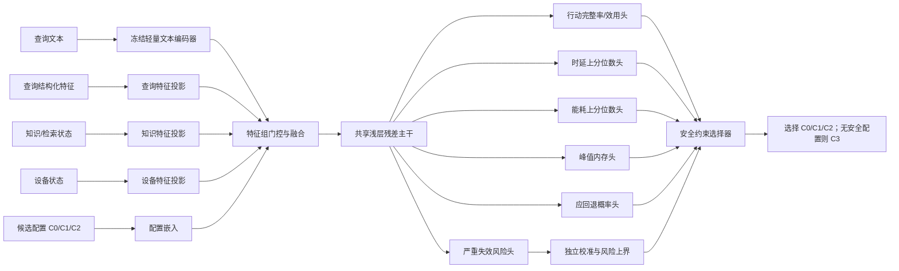

# AI+模型结构设计：离线应急 RAG 逐查询配置选择

## 1. 任务目标

对每个查询 \(q_i\) 和候选配置 \(c\in\{C0,C1,C2\}\)，在执行前预测：

1. 发生 L3 严重失效的风险；
2. 行动完整率或回答效用；
3. 端到端时延、能耗和峰值内存；
4. 当前查询是否应直接进入 C3 安全回退。

随后在独立校准形成的风险约束和设备资源约束下，选择预计资源代价最低的安全配置。
若没有配置满足约束，则选择 C3。

该模型不是生成模型，也不负责直接回答应急问题。它是生成系统前的轻量决策模型。

## 2. 设计原则

当前监督训练查询约 1,440 条，Radxa 资源受限且解释性要求高，因此采用：

> **冻结轻量文本编码器 + 分组结构化特征编码 + 共享浅层主干 + 轻量特征组门控 +
> 多任务输出头 + 独立风险校准。**

明确不采用：

- 从头训练 Transformer；
- 使用大生成模型直接做路由；
- 深层跨模态注意力网络；
- 仅凭模型 softmax 置信度决定安全；
- 将测试结果或 gold evidence 输入路由器。

设计目标是：除冻结文本编码器外，可训练参数尽量控制在约 10 万至 50 万量级；若
编码器在 Radxa 上的净收益不足，则替换为 TF-IDF/BM25 表征，不改变后续模型结构。

## 3. 总体结构



对每个查询分别构造三条 query–configuration 样本，共享模型参数，输出 C0、C1、
C2 各自的预测。三条记录在统计划分和 bootstrap 时仍属于同一查询组。

## 4. 输入层

### 4.1 查询文本输入

输入包括：

- 原始查询文本；
- 语言标识；
- 文本缺失或解析失败标识。

处理方式：

- 使用冻结的小型预训练文本编码器得到固定长度查询向量；
- 编码器不在当前 1,440 条训练查询上全量更新；
- 查询向量经过线性降维、LayerNorm 和激活函数，压缩到 64 维左右；
- Radxa 部署时使用量化编码器；若开销过高，替换为字符/词级 TF-IDF 降维向量。

解决的问题：

- 同义表达、口语、跨语言和词序变化；
- 单纯关键词模型难以识别的语义相近查询；
- 避免小样本从头学习文本表示。

### 4.2 查询结构化特征

建议包括：

- 查询长度、数字和问号数量；
- 灾种、查询类型和语言；
- 信息不足、歧义、多个条件和否定信号；
- 风险等级；
- 是否包含地点、对象、时间和资源条件；
- OOD 或文本异常分数。

类别变量使用小型 embedding 或 one-hot；连续变量使用训练集统计量标准化，并增加
缺失指示变量。

解决的问题：

- 提供清晰、可解释的风险信号；
- 降低文本编码器必须从少量数据重新学习显式规则的压力；
- 支持缺失信息触发 C3。

### 4.3 知识与检索状态

这些特征必须在配置决策前以低成本获得，不能读取 gold evidence。建议包括：

- BM25/轻量检索 top score；
- top-1 与 top-2 margin；
- 候选分数 entropy；
- 证据数量和覆盖代理；
- 最高协议权威等级；
- 协议时效、版本和适用地区匹配；
- 候选协议冲突数；
- 查询灾种与协议灾种匹配；
- 检索失败和索引不可用指示。

对 C0 使用固定的“无检索”标识；C1/C2 可使用同一低成本预检索产生的状态特征，
不能为了预测是否选择 C2 而先完整执行 C2。

解决的问题：

- 区分“查询本身简单”和“当前知识库确实能支持回答”；
- 识别低检索分数、冲突、过期协议和不适用证据；
- 避免 query-only 路由把知识缺口误判为低风险。

### 4.4 设备状态

建议包括：

- 当前温度和最近窗口温升；
- 可用内存；
- CPU 负载；
- 电源/电量状态；
- 是否接近热降频；
- 当前连续工作时长；
- C0–C2 冷态与热态资源画像；
- 遥测缺失或传感器异常标识。

初始版本只使用当前值、滑动均值、最大值和趋势，不直接使用 RNN。

解决的问题：

- 同一查询在冷态和热态下可能需要不同配置；
- 防止选择内存、时延或温度约束下不可运行的 C2；
- 让路由器反映真实边缘设备状态，而非只使用静态 FLOPs。

### 4.5 候选配置输入

每条样本加入候选配置 \(c\) 的可学习 embedding 和静态属性：

- 是否检索；
- 检索深度；
- 是否重排；
- 是否多步；
- 最大上下文；
- 冷态平均资源画像。

配置 embedding 建议为 8–16 维。

解决的问题：

- 一个共享模型同时预测 C0、C1、C2；
- 通过参数共享提高小样本效率；
- 学习同一查询在不同配置下的风险变化。

## 5. 主干网络

### 5.1 分组投影

将每类输入分别投影到紧凑空间：

| 特征组 | 建议投影维度 |
| --- | ---: |
| 文本语义 | 64 |
| 查询结构化特征 | 16–32 |
| 知识状态 | 16–32 |
| 设备状态 | 16–32 |
| 配置 embedding | 8–16 |

每个投影块使用：

```text
Linear → LayerNorm → GELU/ReLU → Dropout
```

分组投影避免高维文本向量完全压制数值特征，也便于进行 `–Query`、`–Corpus` 和
`–Device` 消融。

### 5.2 共享浅层主干

融合后的向量进入两层浅层残差 MLP，例如：

```text
输入 → Linear(128) → GELU → Dropout
    → Linear(64) → GELU
    → 残差/跳连 → 共享表示
```

不建议超过 2–3 个隐藏层。

解决的问题：

- 学习“高风险查询×低证据覆盖×设备过热”等非线性交互；
- 在 C0–C2 之间共享统计强度；
- 限制容量，降低小样本过拟合；
- 保持 Radxa 推理开销较小。

## 6. 特征融合模块

### 6.1 基础融合

第一版使用分组向量拼接：

\[
h_{\mathrm{concat}}
=
[h_{\mathrm{text}},h_{\mathrm{query}},h_{\mathrm{knowledge}},
h_{\mathrm{device}},h_{\mathrm{config}}]
\]

拼接是默认方案，因为数据量小、行为容易诊断。

### 6.2 配置条件门控

在拼接之前，用配置 embedding 对知识和设备特征做轻量门控：

\[
g_k=\sigma(W_k[h_{\mathrm{config}},h_{\mathrm{knowledge}}])
\]

\[
g_d=\sigma(W_d[h_{\mathrm{config}},h_{\mathrm{device}}])
\]

\[
\tilde h_k=g_k\odot h_{\mathrm{knowledge}},\qquad
\tilde h_d=g_d\odot h_{\mathrm{device}}
\]

解决的问题：

- 知识覆盖对 C0 和 C2 的意义不同；
- 温度和内存对高资源配置影响更大；
- 比深层跨模态注意力更省参数。

门控不能删除原始特征。融合时同时保留原始投影和门控投影，防止 gate 错误地完全
屏蔽安全信号。

## 7. 轻量注意力与正则化

### 7.1 特征组注意力

可选用单头特征组注意力，在五个特征组之间计算权重：

\[
a_m=\operatorname{softmax}(w^\top\tanh(W h_m))
\]

\[
h_{\mathrm{attn}}=\sum_m a_m h_m
\]

最终融合使用：

\[
h=[h_{\mathrm{concat}},h_{\mathrm{attn}}]
\]

它解决：

- 不同查询对文本、知识和设备状态的依赖不同；
- 可以观察模型在某次决策中主要依赖哪个特征组；
- 参数量明显低于 token-level cross-attention。

注意力权重只能作为诊断信息，不能解释为因果贡献或安全证明。正式解释仍需要特征
组消融、局部贡献和反事实测试。

### 7.2 正则化模块

建议同时采用：

1. **冻结文本编码器**：降低小样本过拟合；
2. **Dropout 0.05–0.20**：只在训练集/验证集选择；
3. **L2 权重衰减**：限制浅层主干；
4. **特征组 dropout**：训练时随机屏蔽知识或设备特征组，增强遥测缺失稳健性；
5. **输入噪声增强**：对连续设备特征加入与传感器误差相符的小扰动；
6. **缺失指示变量**：不能简单用 0 表示传感器缺失；
7. **早停**：只依据 valid，不使用 calibration 或 test；
8. **梯度裁剪**：防止稀有严重错误造成不稳定更新；
9. **组级采样**：同一查询的 C0–C2 记录保持同一 batch 或同一权重，避免重复放大；
10. **多 seed 训练**：报告模型不确定性。

不建议默认使用 label smoothing，因为 L3 是安全关键稀有标签，平滑可能掩盖明确
正例。存在标注分歧时，应保存标注者分布、裁决结果或样本置信权重。

## 8. 输出层

### 8.1 严重失效风险头

为每个 query–configuration 对输出：

\[
\hat p_{i,c}^{L3}=\sigma(W_r h_{i,c}+b_r)
\]

该概率只作为原始风险分数。最终安全资格由独立校准集上的风险上界决定。

### 8.2 行动完整率/效用头

输出 \([0,1]\) 区间的行动完整率或质量分数：

\[
\hat u_{i,c}=\sigma(W_u h_{i,c}+b_u)
\]

用于在多个安全配置资源相近时避免选择明显低质量配置，也用于质量—安全—资源
Pareto 分析。

### 8.3 资源输出头

建议预测：

- log latency 的中位数和 P95；
- log energy 的中位数和上分位数；
- 峰值内存；
- 约束越界概率。

安全选择使用上分位数或越界概率，不只使用平均资源：

\[
\hat Q_{0.95}(\mathrm{latency}\mid x,c)
\]

\[
\hat Q_{0.95}(\mathrm{energy}\mid x,c)
\]

解决设备测量偏态、长尾和热态风险。

### 8.4 C3 回退头

输出是否因信息不足、知识冲突或所有生成配置不安全而回退：

\[
\hat p_i^{fallback}
\]

同时输出多标签原因：

- `insufficient_information`；
- `knowledge_unavailable`；
- `protocol_conflict`；
- `resource_unavailable`；
- `all_configs_unsafe`。

C3 头提供解释和辅助训练，但最终仍由硬规则与校准安全集合共同决定。

## 9. 损失函数

总损失建议为：

\[
\mathcal L =
\lambda_r\mathcal L_{\mathrm{risk}}
+\lambda_u\mathcal L_{\mathrm{utility}}
+\lambda_l\mathcal L_{\mathrm{latency}}
+\lambda_e\mathcal L_{\mathrm{energy}}
+\lambda_m\mathcal L_{\mathrm{memory}}
+\lambda_f\mathcal L_{\mathrm{fallback}}
+\lambda_{\mathrm{reg}}\lVert\theta\rVert_2^2
\]

所有 \(\lambda\) 只在 valid 上确定，不能用 calibration 或 test 调整。

### 9.1 风险损失

首选二元交叉熵：

\[
\mathcal L_{\mathrm{risk}}
=-\sum_{i,c}
[y_{i,c}\log\hat p_{i,c}
+(1-y_{i,c})\log(1-\hat p_{i,c})]
\]

可与 Brier loss 组合：

\[
\mathcal L_{\mathrm{Brier}}
=\sum_{i,c}(\hat p_{i,c}-y_{i,c})^2
\]

BCE 学习区分，Brier 鼓励概率质量。L3 类别不平衡时优先使用：

- 分层 batch；
- 有上限的正类权重；
- 查询组权重；
- 多 seed；
- 独立校准。

不建议默认使用高 gamma focal loss，因为它可能改善分类排序却恶化概率校准。如果
将 focal loss 作为对照，必须重新独立校准并报告 Brier/ECE。

### 9.2 行动完整率损失

若标签为 \([0,1]\) 连续值，使用 Huber loss：

\[
\mathcal L_{\mathrm{utility}}
=\operatorname{Huber}(\hat u_{i,c},u_{i,c})
\]

Huber 对人工评分中的少量异常更稳健。

### 9.3 资源损失

时延和能耗使用 log 变换后的 Huber loss，并增加 P95 pinball loss：

\[
\mathcal L_{\tau}(y,\hat y)
=
\max(\tau(y-\hat y),(\tau-1)(y-\hat y))
\]

其中 \(\tau=0.95\)。

它解决平均误差无法保护尾时延和热态能耗的问题。

没有物理功率信号时，能耗标签为缺失，使用 loss mask 跳过该项，不能用 token 数或
时延替代焦耳。

### 9.4 回退损失

使用二元或多标签 BCE，分别预测“是否回退”和回退原因。该损失只提供辅助监督，
不能取代安全门。

### 9.5 可选配对排序损失

当同一查询存在多个配置真实结果时，可增加小权重配对损失：

\[
\mathcal L_{\mathrm{rank}}
=\max(0,m+s_{i,c^+}-s_{i,c^-})
\]

用于保持“安全配置风险低于失效配置”的相对顺序。它只能作为辅助项，权重过大会
牺牲概率校准。

## 10. 独立校准与安全选择

训练结束后冻结所有参数。对每个配置在 `cal_op` 上：

1. 计算原始风险分数；
2. 枚举接受阈值；
3. 计算接受集合的 L3 风险上界；
4. 选择满足 \(\alpha,\delta\) 的最大 coverage 阈值；
5. 在 test 上不再修改。

对查询 \(i\) 构造安全可行集合：

\[
\mathcal F_i=
\{c:
\hat r_{i,c}\leq t_c,\,
\hat Q_{0.95}(L_{i,c})\leq B_L,\,
\hat M_{i,c}\leq B_M\}
\]

若 \(\mathcal F_i\neq\varnothing\)，选择预测能耗最低且效用不低于预注册下限的配置；
否则进入 C3。

注意：输出层概率、特征注意力或温度缩放本身都不能证明风险受控，安全声明来自独立
校准数据和明确风险上界。

## 11. 各组件解决的问题

| 组件 | 解决的具体问题 |
| --- | --- |
| 冻结文本编码器 | 同义表达、多语言、小样本语义表示 |
| 查询结构化特征 | 显式风险、歧义和信息不足信号 |
| 知识状态特征 | 区分模型能力不足与知识库无证据/冲突 |
| 设备状态特征 | 避免在热态、低内存或高负载时选择不可行配置 |
| 配置 embedding | 用共享参数建模 C0–C2 的条件差异 |
| 分组投影 | 防止高维文本淹没知识和设备特征 |
| 门控融合 | 学习配置对知识、设备状态的不同敏感度 |
| 特征组注意力 | 低成本调整不同输入组权重并提供诊断 |
| 浅层残差主干 | 学习必要的非线性交互，限制过拟合和设备开销 |
| 多任务输出 | 同时估计安全、质量和资源，避免单一目标路由 |
| BCE/Brier | 学习严重失效概率并改善概率质量 |
| Huber/分位数损失 | 抵抗测量异常并保护尾时延、尾能耗 |
| 特征组 dropout | 适应遥测或检索状态缺失 |
| 独立风险校准 | 将预测分数转化为可检验的安全接受规则 |
| C3 硬回退 | 无安全配置时不强制生成危险答案 |

## 12. 解释性输出

每次路由应保存：

- C0–C2 原始风险分数和校准阈值；
- 各配置的 P95 时延、能耗和内存预测；
- 被排除配置及风险/资源原因；
- 查询、知识、设备和配置特征组贡献；
- 回退原因；
- 模型、知识库、资源画像和阈值版本。

建议解释顺序：

1. 先报告硬约束和校准阈值；
2. 再报告逻辑风险头或浅层模型的局部特征贡献；
3. 用特征组消融验证解释稳定性；
4. 用反事实测试检查：证据覆盖提高、冲突解除或设备降温后，配置是否合理变化；
5. 注意力权重只作辅助诊断。

## 13. 与简单方案的关系

为了证明 AI+ 模块确有必要，必须同时实现：

1. TF-IDF/BM25 + 逻辑回归；
2. 冻结文本编码器 + 逻辑回归；
3. 完整 AI+ 融合模型；
4. `–Corpus`、`–Device`、`–Attention/Gate` 消融；
5. 同特征但无独立校准的版本。

只有完整 AI+ 模型在 matched coverage、多 seed 和 Radxa 实测下获得稳定安全或净
资源收益，才能替代简单方案。如果差异不显著，应采用简单模型作为最终部署方案。

## 14. 当前实现状态

当前 `sci-exp` 已实现：

- query-only 特征；
- 每配置逻辑风险模型；
- BM25 与协议元数据；
- 静态资源画像；
- 独立阈值校准和 C3 回退。

尚未实现本设计中的：

- 冻结文本编码器；
- 完整知识状态向量；
- 实时设备状态输入；
- 特征组门控/注意力；
- 多任务质量和资源预测头；
- 分位数资源损失；
- 完整解释记录。

因此，本文件描述的是下一阶段标准 AI+ 目标结构，不能将当前 smoke 风险模型表述为
已经实现的完整 AI+ 模型。
