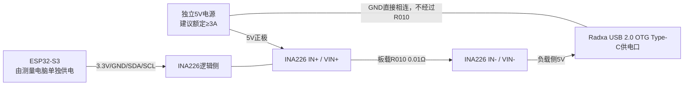

# Radxa ZERO 3W＋INA226 R010＋ESP32-S3接线与测量规程 v1.0

适用设备：Radxa ZERO 3W 8GB，USB-C 5V供电；INA226模块，板载R010
（0.01Ω）分流电阻；SHT31温湿度传感器；ESP32-S3开发板。

> 2026-07-31 实机状态：ESP32-S3 N16R8替换板已到货并可烧录，固件v1.1已通过
> PlatformIO编译。仍需完成COM19串口、INA226 I²C、三点校准和连续稳定性验收；
> 门禁全部通过前，Radxa实验只能标记为无能耗开发诊断，不能形成正式资源或论文结果。

> 在看到INA226模块正反面和ESP32-S3开发板型号前，本规程只能按常见丝印
> `VIN+/IN+、VIN-/IN-、VCC/VS、GND、SDA、SCL`执行。丝印不同、模块带
> `VBUS`独立引脚或没有板载R010时，停止上电并先确认照片。

## 1. 测量位置和原理

INA226放在5V正极的高边。它测量R010两端压差：

`I = Vshunt / 0.01Ω`，再以负载侧总线电压计算`P = Vbus × I`，最后按采样
时间用梯形积分得到`E = ∫Pdt`。



ZERO 3W只允许5V输入。不要使用9V/12V触发板，也不要向USB 3.0 HOST口供电。

## 2. 接线表

### 2.1 5V大电流路径

| 从 | 到 | 要求 |
|---|---|---|
| 5V电源正极 | INA226 `IN+`/`VIN+` | 先经过2.5–3A保险丝；线材和接头按≥3A选择 |
| INA226 `IN-`/`VIN-` | Radxa供电USB-C的VBUS | 必须接USB 2.0 OTG供电口 |
| 5V电源GND | Radxa USB-C GND | 直接连接，不经过分流电阻 |
| 5V电源GND | INA226 `GND` | 与测量系统共地 |

如果使用USB-A转USB-C供电线，建议使用带端子的USB电源分线板，只把VBUS正极
串入INA226。不要凭线皮颜色判断，断电后必须用万用表通断档确认VBUS和GND。

若使用USB-C到USB-C电源，必须使用具备正确CC电阻和5V协商的成品直通/分线板；
不要用只有VBUS/GND的裸Type-C插头猜测接法。

### 2.2 INA226逻辑侧

| INA226 | ESP32-S3 DevKitC-1 | 说明 |
|---|---|---|
| `VCC`或`VS` | `3V3` | 固件和I²C均按3.3V；不要接5V |
| `GND` | `G`/`GND` | 同时接5V系统GND |
| `SDA` | GPIO4 | 与SHT31并联，可在`platformio.ini`修改 |
| `SCL` | GPIO5 | 与SHT31并联，可在`platformio.ini`修改 |
| `ALERT` | 暂不连接 | 本实验采用连续轮询 |
| `A0/A1` | 模块默认状态 | 默认地址应为`0x40`；不符时修改编译参数 |
| 独立`VBUS`（若存在） | INA226 `IN-`负载侧5V | 仅模块没有板上连线时需要 |

I²C线尽量短于20cm。模块一般已有上拉电阻；若没有，在SDA、SCL各加4.7kΩ到
3.3V。不得把I²C上拉到5V。

### 2.3 SHT31环境传感器与Radxa同步UART

| 从 | 到 | 说明 |
|---|---|---|
| SHT31 `VCC/VIN` | ESP32 `3V3` | 不使用5V，避免I²C被上拉到5V |
| SHT31 `GND` | ESP32 `GND` | 公共参考地 |
| SHT31 `SDA` | ESP32 GPIO4 | 与INA226 SDA并联 |
| SHT31 `SCL` | ESP32 GPIO5 | 与INA226 SCL并联 |
| Radxa Pin 18 `UART4_TX_M1` | ESP32 GPIO10 RX | START/STOP命令 |
| Radxa Pin 16 `UART4_RX_M1` | ESP32 GPIO9 TX | ACK/状态 |
| Radxa GND | ESP32 GND | UART公共参考地 |

SHT31固定在Radxa附近但不接触散热器、充电器、ESP32或INA226。其读数记录为
`ambient_temperature_c`和`ambient_relative_humidity_pct`；Radxa SoC温度仍从
`/sys/class/thermal/thermal_zone*/temp`读取。

## 3. ESP32供电和数据连接

推荐让ESP32-S3由Windows测量电脑独立USB供电并采集串口，Radxa通过局域网向
Windows采集器发送查询开始/结束标记。这样ESP32自身耗电不会落入Radxa的输入
功率。

不要直接用Radxa USB口给ESP32供电；否则ESP32、USB-UART或USB链路功耗会被
INA226计入Radxa总能耗。若必须在Radxa本机采集，需要带独立供电的USB隔离器，
并验证隔离器没有从Radxa的VBUS取电。

## 4. 上电前检查

1. 全部断电，确认R010确实位于`IN+`与`IN-`之间。
2. 通断档确认5V正极必须经过R010，GND不能经过R010。
3. 确认Radxa接的是USB 2.0 OTG供电口。
4. 仅给ESP32上电，INA226逻辑电压应约3.3V。
5. 暂不连接Radxa，给5V大电流侧上电；负载侧应约5V，不得高于5.25V。
6. 串口发送`META`，确认地址、R010和校准寄存器。
7. 空载发送`ZERO`，完成零点校准后再连接Radxa。
8. 第一次接Radxa时限流从0.5A逐步增加，并检查接线端、R010和线材温升。

R010在3A时理论压降30mV、耗散0.09W，低于INA226的±81.92mV芯片量程；但模块
端子、铜箔和焊点额定值未知，不能仅凭芯片量程认定可承受8A。

## 5. 固件编译与烧录

固件目录：

`hardware/esp32s3_ina226_power_meter`

安装PlatformIO后：

```powershell
cd D:\projects\RAG-sci\docs\sci-exp\hardware\esp32s3_ina226_power_meter
pio run
pio run --target upload --upload-port COM6
pio device monitor --port COM6 --baud 921600
```

项目也提供带SHA-256构建记录的脚本：

```powershell
.\scripts\构建并烧录ESP32S3_INA226功率计.ps1 -BuildOnly
.\scripts\构建并烧录ESP32S3_INA226功率计.ps1 -UploadPort COM6
```

如果不是官方ESP32-S3-DevKitC-1，先修改`platformio.ini`中的`board`和I²C针脚。
固件v1.1同时向原生USB CDC和UART0输出NDJSON，并从两种串口接收命令，以兼容
N16R8开发板的不同USB实现；空闲或传感器未就绪时每2秒输出一次`status`记录。

支持的串口命令：

| 命令 | 作用 |
|---|---|
| `PING` | 检查通信 |
| `META` | 输出地址、针脚、R010、LSB和校准值 |
| `STATUS` | 输出传感器、采样状态和重试次数 |
| `START` / `STOP` | 开始/停止100Hz功率与1Hz环境NDJSON采样 |
| `ENV` | 立即读取一次SHT31环境温湿度 |
| `ZERO` | Radxa断开、零电流时取64点零点 |
| `CAL 1.000` | 参考表显示1.000A且负载稳定时校准增益 |
| `RESET_CAL` | 恢复零偏0、增益1 |
| `SYNC <epoch_ns>` | 记录主机—ESP时间对应点 |
| `MARK <标记>` | 在ESP数据流内写入标记 |

## 6. 校准与论文级质量控制

1. **零点**：Radxa断开但INA226已上电，执行`ZERO`。
2. **电流增益**：使用校准过的台式电源/电子负载/参考表，在0.5A、1A、2A至少
   三点验证；`CAL`只使用中间稳定点。
3. **电压**：用万用表在Radxa USB-C入口侧测量，和`bus_v`比较。
4. **验收**：每点稳定采集30秒，报告均值、标准差和相对误差；预设目标为电流、
   电压和功率误差均不超过2%，否则不得用于主结果。
5. **时间**：每个查询由采集器接收`query_start/query_end`标记；标记RTT应记录。
6. **采样完整性**：目标功率采样率不低于100Hz，最大采样间隔不得超过30ms；任何`current_saturated`、
   `shunt_near_limit`、`undervoltage`或`integration_gap`均使该次运行无效。
7. **C3**：C3通常短于50ms采样周期，必须批量运行后按次数摊销，不能用单次
   两点积分声称每查询能耗。

将三点结果填写到
`data/annotations/INA226三点校准记录模板_v1.0.csv`，然后运行：

```powershell
python scripts\验证INA226三点校准.py `
  --input data\annotations\INA226三点校准记录_v1.0.csv `
  --output data\logs\INA226三点校准_v1.0.json
```

## 7. 正式采集

Windows测量电脑：

```powershell
python scripts\采集INA226串口功率.py `
  --serial COM6 `
  --output data\raw\runs\INA226_原始功率_会话001.jsonl `
  --marker-host 0.0.0.0 `
  --marker-port 8765
```

在Radxa终端设置Windows测量电脑局域网IP。Windows防火墙只需允许该电脑局域网
接口上的UDP 8765：`export SCI_EXP_METER_HOST=192.168.x.x`。

实验结束后：

```powershell
python scripts\整合INA226查询能耗.py `
  --meter-log data\raw\runs\INA226_原始功率_会话001.jsonl `
  --output data\processed\INA226_查询能耗_会话001.jsonl `
  --runs results\radxa_experiment_runs.jsonl `
  --merged-runs-output results\radxa_experiment_runs_with_energy.jsonl
```

原始日志必须保留，不得只保存积分结果。

## 8. 还需要实物确认的项目

- INA226模块正反面、端子丝印、R010功率等级、A0/A1状态；
- ESP32-S3开发板完整型号和USB接口类型；
- 5V电源额定电流、线缆和USB分线板结构；
- 是否具备参考万用表、电子负载或可信USB功率表；
- Radxa散热器、外壳和风扇状态。
