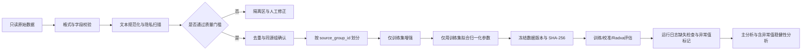

# 可复现数据预处理流程

## 1. 适用范围

本流程适用于离线应急 RAG 研究中的四类数据：

1. **查询数据**：应急问题文本、灾种、查询类型、风险等级、回退标签、必需/禁止行动和同源组；
2. **协议与知识库数据**：公开应急协议、指南、版本、辖区、有效期、权威等级及切块文本；
3. **查询—配置实验结果**：C0–C3 的回答、检索证据、严重失效标签、行动完整率和人工判定；
4. **Radxa 资源遥测**：时延、能耗、峰值内存、温度、负载、运行状态和重复编号。

目标不是把所有数据变成“没有异常”的整洁表，而是使每一次变换可解释、可复跑、可审计，并防止预处理引入数据泄漏或安全标签污染。

## 2. 总流程



固定顺序是：

> 先清洗基础样本 → 再按同源组划分 → 只增强训练集 → 只在训练集拟合归一化参数。

如果先增强或先计算全体数据的均值、标准差，再进行划分，就会把校准集和测试集信息泄漏给训练过程。

## 3. 目录与不可变输入

推荐目录：

```text
data/
├── raw/                         # 原始数据，只读
├── processed/                   # 规范化后的完整数据
├── splits/                      # train/valid/cal/test
├── quarantine/                  # 待人工处理的异常记录
├── logs/                        # 事件日志、质量报告和哈希
├── annotations/                 # 专家标注
└── schemas/                     # JSON Schema
```

规则：

- 预处理程序不得覆盖 `data/raw/`；
- 不直接删除异常样本；
- 原始记录不合格时写入隔离文件并给出原因码；
- 人工修正应生成新的输入版本，而不是修改已有输出；
- `sci-exp` 复制到 `/home/radxa/sci-exp` 前冻结输入哈希；
- 同一输入哈希、代码版本、参数和 seed 应产生相同的规范化文本与划分。

## 4. 查询文本预处理

### 4.1 字段要求

| 字段 | 缺失处理 | 异常检查 | 是否允许自动填补 |
|---|---|---|---|
| `query_id` | 隔离 | 空值、重复、冲突重复 | 否 |
| `text` | 隔离 | 过短、过长、重复字符、敏感信息 | 否 |
| `disaster_type` | 隔离 | 未在冻结词表、与证据冲突 | 否 |
| `query_type` | 隔离 | 未在冻结词表 | 否 |
| `risk_level` | 隔离 | 必须为整数 0–3 | 否 |
| `language` | 隔离 | 与文本检测结果不一致时警告 | 否 |
| `should_fallback` | 隔离 | 必须为布尔值 | 否 |
| `source_group_id` | 隔离 | 空值、同源样本分组不一致 | 否 |
| `gold_evidence_ids` | 默认为空并记录警告 | 引用不存在的证据 | 仅允许空列表 |
| `required_actions` | 默认为空并记录警告 | 重复或互相矛盾 | 仅允许空列表 |
| `prohibited_actions` | 默认为空并记录警告 | 与必需行动重叠 | 仅允许空列表 |

`risk_level`、`should_fallback`、严重失效和行动标签属于安全关键标签，任何情况下都不能用众数、模型预测或前向填充自动补齐。

### 4.2 文本规范化

当前程序执行：

- Unicode NFKC 规范化；
- 统一 `CRLF`/`CR` 为 `LF`；
- 删除零宽字符和字节顺序标记；
- 合并多余水平空白；
- 最多保留两个连续换行；
- 去除首尾空白；
- 列表字段去空、保持原顺序并去重。

不执行：

- 不删除否定词；
- 不做词干化；
- 不删除标点和数字；
- 不把“不要”“不能”等安全语义停用词去掉；
- 不做可能改变灾种、行动主体、时间、剂量或方向的自动改写。

### 4.3 隐私扫描

自动检测手机号、邮箱、身份证样式和带字段名的精确经纬度。命中后：

1. 记录不进入训练或评估输出；
2. 隔离副本中的敏感值被遮盖；
3. 事件日志记录敏感信息类别而不记录原值；
4. 原始输入由受限区的数据管理员处理。

规则检测不能发现全部姓名、地址和罕见事件组合，因此正式数据仍需人工复核。

### 4.4 重复与泄漏

- 相同 `query_id`、内容完全一致：保留第一条，其余进入隔离区；
- 相同 `query_id`、内容或标签冲突：全部隔离，由人工裁决；
- 规范化文本相同但 `source_group_id` 不同：全部隔离，防止同一句进入不同集合；
- 同一事件、模板、原始问询或其改写必须共用一个 `source_group_id`；
- 近重复检测建议在冻结数据时增加字符 n-gram/Jaccard 或语义相似度人工复核，但不能仅凭相似度自动删除。

### 4.5 长度异常

程序默认接受 4–1000 个规范化字符。该阈值不是统计裁剪值，而是格式安全门：

- 少于 4 字符通常无法形成可判断的查询；
- 超过 1000 字符可能混入完整文档、日志粘贴或提示注入；
- 连续同一字符达到 50 次视为采集/编码异常。

正式研究应在数据冻结前根据预注册方案修改阈值，并报告被隔离的数量和类别。

## 5. 缺失值处理

### 5.1 查询和标签数据

采用“安全关键字段不插补”的原则：

- 标识、文本、分组和安全标签缺失：隔离；
- 可选证据/行动列表缺失：转为空列表并记录警告；
- 元数据缺失：保留为空或 `unknown`，不得根据测试集分布推断；
- 协议辖区、版本、有效期缺失：不得进入正式知识库，只能标记为演示或待审；
- 专家标签缺失：该查询—配置记录不进入风险模型训练和校准。

### 5.2 资源遥测

| 指标 | 正式实验缺失时 | 烟雾测试 |
|---|---|---|
| `latency_ms` | 隔离该运行 | 同样隔离 |
| `energy_j` | 隔离，不以时延代替 | 可显式使用 `--allow-missing-energy` |
| 峰值内存 | 标记缺失；不得参与内存画像 | 可继续功能验证 |
| 温度 | 标记缺失；不能得出热稳定性结论 | 可继续功能验证 |
| 失败运行 | 保留并标为不可用于资源均值 | 保留 |

不得用总体均值填补能耗或温度，也不得把缺失能耗写成 0。

## 6. 异常值处理

### 6.1 查询异常

查询异常采用规则隔离，不做 winsorize：

- 字段类型错误；
- 标签越界；
- 过短/过长；
- 大量重复字符；
- 直接标识符；
- 冲突重复；
- 跨组完全重复。

### 6.2 Radxa 数值异常

时延、能耗、内存和温度按配置 C0–C3 分开检测。样本数至少为 5 时，使用：

\[
\operatorname{MAD}=\operatorname{median}(|x_i-\operatorname{median}(x)|)
\]

\[
z_i^{robust}=0.67448975
\frac{x_i-\operatorname{median}(x)}{\operatorname{MAD}}
\]

默认当 \(|z_i^{robust}|>3.5\) 时添加异常标记。

处理原则：

- 默认只标记、不删除；
- 主分析保留所有有效测量；
- 稳健性分析可比较“全部数据”和“排除有明确测量故障证据的数据”；
- 只有功率计断连、设备重启、日志损坏等可验证原因才允许排除；
- 排除规则必须在查看方法结果前预注册；
- 报告每个配置的异常数量、原因和是否影响结论。

热节流产生的高时延不是统计噪声，而是资源受限设备的真实部署现象，不应仅因数值较大被删除。

## 7. 归一化

### 7.1 文本

原始文本只做第 4.2 节的确定性规范化。BM25 使用自身的语料统计，不把测试查询加入索引统计。

### 7.2 数值特征

对逻辑风险模型的连续特征使用训练集参数：

\[
x'=\frac{x-\mu_{train}}{\max(\sigma_{train},10^{-8})}
\]

要求：

- `mean` 和 `scale` 只用 `train` 拟合；
- valid、calibration 和 test 只应用冻结参数；
- 每个 seed 单独拟合训练参数；
- 参数随模型文件保存；
- 二元特征通常保持 0/1；
- 风险等级为有序变量，主分析保留原编码，稳健性分析可比较独热编码；
- 时延、能耗等偏态变量用于预测模型时可在训练集上拟合 `log1p`，但结果表仍报告原单位。

现有 `risk_model.py` 已将训练均值和尺度保存在每个配置的模型中，预测时复用，不会重新用测试集估计。

## 8. 数据增强

增强默认关闭。启用时必须在分组划分之后，只作用于 `train`：

- 当前可执行实现仅提供标点风格变体，最多 2 个副本；
- 增强样本继承原 `source_group_id`；
- 新增 `augmentation_parent_id` 和 `augmentation_type`；
- valid、`cal_op`、`cal_ch`、`test_op`、`test_ch` 永不增强；
- 不能改变否定、数字、剂量、方位、对象、灾种和必需/禁止行动；
- 回译、生成式释义和错别字增强必须经专家抽检后另行启用；
- 增强前后分别报告样本量，不能把增强副本算成独立真实样本。

增强质量门槛建议：

- 随机抽检不少于每种增强 100 条或全部增强样本的 10%，取较大者；
- 语义标签保持率应不低于 99%；
- 任何安全语义翻转都暂停该增强方法；
- 主结果同时报告不增强版本，证明结论不依赖合成改写。

## 9. 划分策略

现有确定性分组划分比例：

| 集合 | 比例 | 用途 |
|---|---:|---|
| `train` | 40% | 拟合风险模型和归一化参数 |
| `valid` | 10% | 模型和超参数选择 |
| `cal_op` | 13.33% | 操作分布下的阈值校准 |
| `cal_ch` | 6.67% | 挑战分布校准/诊断 |
| `test_op` | 20% | 操作分布最终结果 |
| `test_ch` | 10% | 跨灾种、噪声或分布偏移测试 |

划分依据是：

\[
u_g=\operatorname{SHA256}(\text{seed}:\text{source\_group\_id})
\]

将哈希映射到 \([0,1)\) 后按固定阈值分配，所以不依赖输入行顺序。

质量要求：

- `query_id` 不得跨集合；
- `source_group_id` 不得跨集合；
- 同一协议派生模板不得跨集合；
- 增强父样本与子样本只能在 train；
- 测试集冻结后不得因结果不理想而重新抽 seed；
- 正式数据应检查灾种、风险等级、语言和回退标签分布；
- 极小类别无法兼顾比例时，以不泄漏为先，并用置信区间反映不确定性。

若论文声称跨时间泛化，应另设按发布日期切分的时间外测试；若声称跨地区泛化，应预留完整辖区作为外部测试，不能只用随机分组结果支撑。

## 10. 协议与知识库预处理

输入来源登记表至少包含：

- `source_id`、文件路径、发布机构和 URL；
- 适用辖区和人群；
- 版本、生效日期、失效日期；
- 权威等级、灾种和适用条件；
- 许可证或使用依据；
- 原始文件 SHA-256。

当前命令：

```bash
python3 -m sci_exp.cli prepare-protocols \
  --registry data/raw/protocols/source_registry.jsonl \
  --output data/processed/protocols.jsonl \
  --target-characters 600 \
  --overlap-characters 80
```

处理规则：

- TXT/Markdown 直接读取 UTF-8；
- PDF 使用 `pypdf` 提取，扫描件 OCR 需另行记录工具和版本；
- 统一空白后，以段落和句末优先切分；
- 默认目标 600 字符、重叠 80 字符；
- `evidence_id` 由来源 ID 和稳定序号组成；
- 过期、被替代、草稿和演示协议不得混入正式 current 索引；
- 切块后抽检表格、否定、步骤序号、跨页断句和辖区信息；
- 协议切块不与查询一起做数据增强。

建议正式质量门槛：

- 100% 来源可追溯；
- 100% 有状态和辖区；
- current 协议无已知失效版本；
- 抽检切块不得丢失否定词、行动主体或关键步骤；
- `gold_evidence_ids` 必须全部存在于冻结知识库。

## 11. 查询—配置标签处理

人工判定应用前检查：

- `query_id`、`configuration` 和 `repetition` 唯一匹配；
- 所有成功运行都有严重失效标签；
- 失败运行不伪造人工质量标签；
- 标注员 ID、时间、手册版本和裁决状态可追溯；
- `severe_failure` 必须为布尔值；
- `action_completeness` 范围固定；
- `evidence_correct` 的判定基于冻结协议版本；
- 标注分歧在独立文件中裁决，不能覆盖原始标注。

标签数据不做数值平滑。类别不平衡在训练损失、采样或阈值校准阶段处理，不能通过复制测试集失败样本解决。

## 12. Radxa 运行日志预处理

正式命令：

```bash
cd /home/radxa/sci-exp
export PYTHONPATH=/home/radxa/sci-exp/src
python3 -m sci_exp.cli preprocess-runs \
  --input results/radxa_runs.jsonl \
  --output results/radxa_runs.cleaned.jsonl \
  --robust-z-threshold 3.5 \
  --fail-on-quarantine
```

仅烟雾验证、尚无物理能耗信号时：

```bash
python3 -m sci_exp.cli preprocess-runs \
  --input results/smoke_runs.jsonl \
  --output results/smoke_runs.cleaned.jsonl \
  --allow-missing-energy
```

正式论文结果不得使用 `--allow-missing-energy` 后声称获得能耗结论。

每条输出添加：

- 预处理版本；
- 原始行号；
- 是否可进入资源分析；
- 异常指标列表。

失败运行被保留，但 `analysis_eligible=false`；这样既不会污染资源均值，也不会隐瞒系统失败率。

## 13. 可执行查询预处理

Windows：

```powershell
Set-Location D:\projects\RAG-sci\docs\sci-exp
.\scripts\run_preprocess.ps1 `
  -Queries data\raw\public_datasets\queries.jsonl `
  -Seed 42 `
  -AugmentTrainCopies 0
```

Radxa：

```bash
cd /home/radxa/sci-exp
bash scripts/run_preprocess.sh \
  data/raw/public_datasets/queries.jsonl \
  42 \
  0
```

等价底层命令：

```bash
python3 -m sci_exp.cli preprocess-queries \
  --input data/raw/public_datasets/queries.jsonl \
  --output-directory data \
  --seed 42 \
  --augment-train-copies 0 \
  --fail-on-quarantine
```

输出：

```text
data/processed/queries.cleaned.jsonl
data/splits/*.jsonl
data/splits/split_manifest.json
data/quarantine/queries.quarantine.jsonl
data/logs/query_preprocess_events.jsonl
data/logs/query_preprocess_report.json
```

`--fail-on-quarantine` 会在发现问题记录时返回非零状态，但仍生成隔离文件和报告，便于修正。它不会删除或改写原始输入。

## 14. 质量检查

### 14.1 阻断性检查

以下任一不通过，正式实验不得继续：

- [ ] 输入 JSONL 可解析，每行都是对象；
- [ ] 所有必需字段存在且类型正确；
- [ ] 风险和回退标签没有自动插补；
- [ ] 无检测到的直接个人标识符进入输出；
- [ ] `query_id` 唯一；
- [ ] 无同源组跨集合；
- [ ] 无规范化文本跨组完全重复；
- [ ] `gold_evidence_ids` 全部存在；
- [ ] 协议来源、状态、辖区和版本完整；
- [ ] valid/cal/test 没有增强样本；
- [ ] 正式 Radxa 运行具有物理能耗数据；
- [ ] 数据、划分和日志哈希已经保存。

### 14.2 报告性检查

以下项目必须报告，但不一定阻断：

- 各集合、灾种、风险等级、语言和回退标签数量；
- 文本长度的中位数、IQR、P5 和 P95；
- 每种隔离原因的数量；
- 可选字段缺失率；
- 增强样本数量与人工抽检结果；
- 各配置的资源指标缺失率；
- 每个资源指标的异常标记数；
- 失败运行率；
- 数据版本、代码版本、参数、seed 和运行时间。

## 15. 日志与可复现性

查询质量报告记录：

- 预处理版本；
- 参数和 seed；
- 输入行数、接受数、增强数和隔离数；
- 隔离原因分布；
- 划分和类别摘要；
- 输入、规范化输出、隔离文件和事件文件 SHA-256。

`split_manifest.json` 记录：

- seed；
- 输入哈希；
- 每个集合的行数；
- 每个集合文件的 SHA-256。

资源质量报告记录：

- 是否要求能耗；
- robust-z 阈值；
- 缺失指标数量；
- 异常标记数量；
- 失败和可分析运行数量；
- 输入和所有输出哈希。

建议实验论文额外保存：

```text
git commit
Python 版本
操作系统和内核
Radxa 型号与设备序列化匿名 ID
模型/协议/配置哈希
命令行参数
环境依赖锁文件
UTC 开始与结束时间
```

动态 UTC 时间不会影响规范化结果，但会使报告文件哈希随运行变化。比较是否可复现时，应比较规范化数据和 split 文件哈希，而不是要求整份带时间戳报告的哈希相同。

## 16. 主分析与稳健性分析

主分析：

- 使用全部通过结构和隐私质量门槛的样本；
- 保留被标记但无测量故障证据的 Radxa 数值异常；
- 使用固定 seed 和预注册分组；
- 使用不增强或预注册增强版本；
- 归一化仅拟合 train；
- 最终结论只使用冻结的 `test_op`/`test_ch`。

稳健性分析：

- 更换划分 seed，但保持同源组约束；
- 比较增强和不增强；
- 比较原尺度与训练集 `log1p` 资源特征；
- 排除有明确硬件/采集故障证据的运行；
- 比较不同 robust-z 阈值，但不据此选择最好结果；
- 按灾种、辖区、语言噪声和设备热状态分层；
- 报告结论方向是否改变。

## 17. 当前实现状态

已实现：

- 查询 Unicode/空白规范化；
- 必需字段、类型和范围检查；
- 可选列表缺失警告；
- 敏感信息检测、遮盖和隔离；
- 长度、重复字符和重复 ID 检查；
- 跨 `source_group_id` 完全重复文本检查；
- 确定性分组划分；
- 划分后仅训练集标点增强；
- Radxa 日志缺失检查；
- 按配置的 MAD 稳健异常值标记；
- 输入输出 SHA-256、事件日志和质量报告；
- Windows/Radxa 一键查询预处理脚本；
- 自动化单元测试。

尚需在获得正式数据后补充：

- 冻结灾种和查询类型词表；
- 中文姓名、地址和机构名称的人工/NER 复核；
- 近重复语义检测；
- 协议日期和辖区一致性自动检查；
- 标签员一致性和裁决报告；
- 时间外和地区外测试集的正式定义；
- Radxa 物理功耗源和设备异常原因编码。
