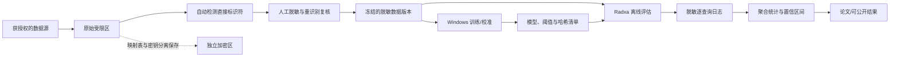

# 研究方案伦理风险审查与审批材料要点

## 1. 审查对象与结论

研究主题：

> 资源受限边缘设备上离线应急 RAG 的校准安全约束逐查询配置选择  
> Calibrated Safety-Constrained Per-Query Configuration Selection for Offline Emergency RAG on a Resource-Constrained Edge Device

本研究不是普通的文本分类或设备能耗实验。系统虽然只负责为每条查询选择 RAG 配置，但该选择会间接决定检索范围、生成模型能力、响应时延和答案质量。在应急场景中，错误降级、错误接受或不恰当拒答可能影响生命健康、救援行动和公共秩序。

总体伦理风险等级建议评定为：

- **当前仅使用合成查询、公开协议和离线 Radxa 性能测试：中等风险**；
- **使用真实应急问询、健康记录、精确位置或开展参与者实验：中高风险**；
- **将输出用于临床分诊、疏散指令、救援资源分配或面向公众自动发布：高风险，且超出当前研究批准范围**。

伦理审查建议：

1. 在使用真实个人数据、招募参与者或开展现场验证前，向所在单位提交科技伦理/人工智能科技伦理审查；
2. 涉及患者、健康记录、人体研究参与者时，同时按涉及人的生命科学和医学研究伦理程序办理；
3. 当前原型只应定位为**研究用决策支持系统**，不得表述为临床诊断、公共预警或应急指挥系统；
4. 现场部署、公众开放和真实决策应用必须另行进行伦理、数据保护、安全和行业监管评估。

依据 2026 年《人工智能科技伦理审查与服务办法（试行）》，可能对生命健康、公共秩序等带来伦理风险的人工智能科技活动应开展伦理审查，审查内容包括公平性、鲁棒性、可干预性、透明度、可追溯性和隐私保护。依据 2023 年《科技伦理审查办法（试行）》，涉及个人信息，或虽不直接涉及人但可能影响生命健康、公共秩序的科技活动，同样属于伦理审查范围。

## 2. 适用阶段与研究边界

| 阶段 | 允许的活动 | 必须满足的条件 | 当前禁止的活动 |
|---|---|---|---|
| A：算法与烟雾测试 | 合成查询、公开协议、公开许可数据、模拟设备状态、Radxa 离线性能测试 | 不包含可识别个人信息；输出不用于实际行动 | 用烟雾测试结果宣称临床或公共安全有效 |
| B：正式离线研究 | 经许可的历史语料、专家标注、离线用户研究、受控红队测试 | 伦理批准、数据授权、知情同意或获批豁免、脱敏、访问控制 | 在真实应急过程中影响参与者决策 |
| C：受控情景验证 | 演练环境中的专业人员测试、故障和回退验证 | 单独修订审批；人工监督；停止规则；不连接真实指挥链 | 自动发布预警、自动分诊、自动资源分配 |
| D：真实部署 | 真实医疗、教育或公共应急决策支持 | 重新开展伦理、合规、临床/行业验证与责任评估 | 未经批准直接从研究原型转为生产系统 |

本文件只为 A、B 阶段提供可执行要求，并为 C、D 阶段设置禁止越界条件。

## 3. 伦理风险矩阵

评分定义：

- 发生可能性：1（极低）至 5（很高）；
- 后果严重度：1（轻微）至 5（灾难性）；
- 固有风险 = 可能性 × 严重度；
- 残余风险是在落实控制后估计的风险，正式数值应由项目负责人和伦理委员会共同确认。

| 风险 | 主要触发情形 | 可能性 | 严重度 | 固有风险 | 核心控制 | 预计残余风险 |
|---|---|---:|---:|---:|---|---|
| 个人信息泄露 | 查询、日志含姓名、电话、健康状态、位置 | 4 | 4 | 16 | 数据最小化、分区存储、加密、权限和日志脱敏 | 中 |
| 重识别 | 稀有灾情、时间和位置组合可指向个人 | 3 | 4 | 12 | 泛化时空粒度、抑制小单元、重识别测试 | 中低 |
| 无效或受压迫的同意 | 在真实灾情、医疗或权力关系下招募 | 3 | 4 | 12 | 不在急性危机中招募；独立说明；允许无损退出 | 中低 |
| 算法群体偏差 | 方言、低识字、残障、边远地区数据不足 | 4 | 4 | 16 | 分层采样、群体指标、最差群体约束、人工复核 | 中 |
| 节能导致不安全降级 | 资源目标压过安全目标 | 4 | 5 | 20 | 安全优先的词典序决策；不安全配置不得参与能耗比较 | 中 |
| 幻觉或协议冲突 | 检索失败、知识过期、跨地区协议混用 | 4 | 5 | 20 | 证据引用、版本/辖区检查、C3 回退、人工接管 | 中 |
| 系统误用 | 被当作权威诊断、疏散或救援指令 | 4 | 5 | 20 | 明示研究用途、角色权限、输出标识、禁止自动广播 | 中 |
| 数据/知识库投毒 | 协议文件或模型被替换 | 3 | 5 | 15 | 哈希清单、签名版本、只读知识库、来源白名单 | 中低 |
| 设备被盗或物理访问 | Radxa 存有模型、日志或映射表 | 3 | 4 | 12 | 磁盘/文件加密、账户最小权限、自动锁定、密钥分离 | 中低 |
| 自动决策不可申诉 | 用户无法知道为何降级或拒答 | 3 | 4 | 12 | 记录选择理由、风险上界、人工覆盖和异议通道 | 中低 |
| 标注员心理伤害 | 暴露于伤亡、灾害和创伤文本 | 3 | 3 | 9 | 告知内容、轮换、休息、可退出、心理支持信息 | 低 |
| 临床或公共决策伤害 | 输出被直接用于诊疗、分诊或命令 | 2 | 5 | 10 | 当前阶段完全禁止；未来另审 | 低（在禁用前提下） |

任何固有风险达到 15 以上的项目均不应只靠免责声明控制，必须设置技术控制、流程控制和停止规则。

## 4. 个人隐私与数据保护

### 4.1 可能出现的个人信息

真实应急查询和日志可能包含：

- 姓名、电话、设备标识、账户标识；
- 家庭住址、精确经纬度、避难位置和行动轨迹；
- 伤情、疾病、用药、残障、孕产状态等健康信息；
- 年龄、未成年人身份、职业或救援人员身份；
- 时间戳、罕见事件描述及可推断个人身份的自由文本；
- 模型输入、检索片段、输出、人工修订和设备遥测之间的关联标识。

健康信息、精确位置和不满十四周岁未成年人的个人信息属于高敏感类别，应采用更严格的必要性、授权和保护措施。不能因为系统离线运行就认定没有隐私风险：Radxa 的本地日志、Windows 训练副本、移动硬盘和人工导出的 CSV 均可能形成泄露路径。

### 4.2 数据最小化

每个数据字段必须对应一个已写明的研究目的：

| 字段类别 | 默认处理 | 只有在何种情况下保留 |
|---|---|---|
| 姓名、电话、证件号 | 不采集；已有数据立即替换 | 原研究目的不可避免且获得明确批准 |
| 精确位置 | 转换为行政区或距离区间 | 研究地理鲁棒性且无法用粗粒度替代 |
| 精确时间 | 转换为日期或相对时间 | 分析时延、灾情阶段确有必要 |
| 健康信息 | 只保留与应急任务直接相关的标签 | 已批准的医学研究目的 |
| 原始自由文本 | 脱敏后进入研究库 | 需要保留语言现象且已完成人工复核 |
| 设备遥测 | 与人员身份分离 | 用于资源、时延、温度或能耗分析 |
| IP、MAC、账户名 | 不写入实验结果 | 安全审计确有必要且单独限期保存 |

不得以“以后可能有用”为理由扩大采集范围。

### 4.3 本项目的数据分区

建议在 `/home/radxa/sci-exp` 和 Windows 工作副本中使用同样的逻辑分区：

1. **原始受限区**：原始数据，仅数据管理员可访问；
2. **脱敏工作区**：训练、校准和评估使用的版本；
3. **公开协议区**：来源、许可、版本和辖区清晰的知识文件；
4. **模型与配置区**：模型、阈值、配置清单和哈希；
5. **结果区**：只保存不可逆聚合结果和脱敏日志；
6. **密钥/映射区**：不得放在 `sci-exp` 可复制实验包内，应与数据物理分离。

将 `sci-exp` 从 Windows 复制到 Radxa 前，应运行数据清单检查，确认不存在姓名、电话、证件号、精确地址、密钥、访问令牌和原始映射表。

### 4.4 保留和销毁

伦理申请中必须逐类写明：

- 保存目的；
- 保存责任人；
- 保存位置；
- 保存期限；
- 到期后的逐文件安全删除或介质处置方法；
- 参与者撤回后哪些数据可删除、哪些聚合结果已无法回溯。

不得只写“研究结束后删除”。建议将原始可识别数据保存期设为完成脱敏和质检所需的最短时间；脱敏研究数据和审计记录按机构政策及伦理批件保存。任何延长都应形成修订记录。

## 5. 知情同意

### 5.1 需要同意的情形

以下活动原则上应取得参与者有效同意：

- 招募普通公众、学生、医务人员或救援人员进行查询、评价或访谈；
- 采集声音、图像、位置、健康状况或交互日志；
- 将参与者数据用于训练、校准或后续未明确说明的研究；
- 展示可能使参与者被识别的案例或原句。

知情同意说明应至少包含研究目的、活动内容、预计时长、风险和受益、数据类别、保存期限、谁能访问、是否共享、退出方式、补偿、联系人和投诉渠道。

### 5.2 应急场景中的特殊问题

真实受灾者可能处于恐惧、疼痛、认知负荷过高或依赖救援者的状态，其同意能力和自愿性可能受损。因此：

- 当前研究不应在正在发生的真实危机中临时招募受灾者；
- 不把获得救助、医疗、课程成绩或工作评价与参加研究绑定；
- 专业人员若由其上级招募，应提供不经上级的拒绝和退出渠道；
- 无法事先同意的历史数据，不由研究团队自行认定豁免，应向伦理委员会提交豁免申请和最小风险论证；
- 法律在紧急保护生命健康时允许的处理基础，不等于事后研究复用自动获得豁免。

### 5.3 易受影响人群

若涉及未成年人、患者、残障人士、低识字人群、被管理人员或一线应急人员，应说明：

- 为何必须纳入该群体；
- 是否存在风险更低的替代样本；
- 适龄、易懂和无障碍的说明材料；
- 监护人许可及参与者本人同意/赞同安排；
- 退出后不受惩罚的机制；
- 额外的隐私和心理保护措施。

当前研究建议不招募未成年人；确有教育场景研究必要时，应另行修订伦理申请。

## 6. 数据脱敏与重识别控制

### 6.1 匿名化和去标识化不能混用

- **去标识化/假名化**：通过编码替换直接身份，但研究团队或其他方仍可能借助映射表或外部数据恢复身份；
- **匿名化**：在合理手段下无法识别且不可复原。

把姓名换成编号通常只是去标识化，不应在论文或伦理材料中写成“完全匿名”。

### 6.2 推荐脱敏流程

1. 数据进入原始受限区后生成内部记录号；
2. 删除姓名、电话、证件号、账号、设备号和精确地址；
3. 对位置、时间、年龄、职业和罕见事件做泛化或分箱；
4. 使用规则和命名实体识别进行第一轮自动检测；
5. 由经授权人员进行第二轮人工复核；
6. 检查自由文本中的亲属关系、机构名称和罕见组合线索；
7. 抽样开展链接攻击/重识别测试；
8. 将映射表和密钥移出研究工作区；
9. 记录脱敏脚本版本、词典版本、复核者和日期；
10. 发布时仅提供合成示例或经过再次审查的短片段。

### 6.3 质量控制标准

- 直接标识符检出率目标为 100%；
- 脱敏抽检至少由两人独立复核高风险自由文本；
- 不公开小样本群体的逐条结果；
- 任何可能唯一定位事件或个人的组合均升级人工审查；
- 脱敏失败率、误删率和重识别测试结果写入数据卡，而不是只报告“已脱敏”。

## 7. 算法偏见与公平性

### 7.1 可能的偏见来源

- 公开灾害语料偏向高资源地区、重大事件和标准书面语；
- 低识字、错别字、方言、少数民族语言和口语查询代表不足；
- 医疗或行动能力假设可能忽略老年人、儿童和残障人士；
- 不同地区应急协议存在差异，主流地区的规则可能被错误泛化；
- 历史求助数据本身反映服务可达性不平等；
- 标注专家可能对“完整答案”“安全答案”或“应回退”的标准不一致；
- 设备资源状态可能与使用地点、网络基础设施和社会经济条件相关；
- 路由器可能更频繁地把某些群体的查询分配到 C3 回退或低能力配置。

### 7.2 必须报告的群体指标

在样本量允许且不会造成重识别的前提下，至少按以下维度审计：

- 灾种和风险等级；
- 语言、方言或文本噪声等级；
- 城乡/区域和协议辖区；
- 年龄相关表达、残障相关需求及低识字表达；
- 查询长度、歧义程度和证据可得性；
- Radxa 资源状态和候选配置。

每组报告：

- L3 严重失效率及其置信区间；
- 安全接受率和 C3 回退率；
- 错误降级率；
- 校准误差、风险上界覆盖情况；
- 关键行动完整率；
- P95 时延和能耗；
- 最差群体结果，而不是只报告总体均值。

### 7.3 公平性控制原则

1. 不要求各群体具有相同接受率，而要求任何群体都不得超过预注册安全风险阈值；
2. 资源节约目标只在满足安全约束的配置之间比较；
3. 某群体校准样本不足时，应扩大回退而不是放松阈值；
4. 阈值和特征不得使用受保护属性作为降低服务质量的捷径；
5. 若总体结果改善但最差群体显著恶化，不得宣称系统整体更安全；
6. 对协议辖区不明、语言无法可靠解析或证据不足的查询，应转入 C3 并提示人工接管。

## 8. 误用、安全与双重用途风险

### 8.1 可预见误用

- 将研究输出冒充政府、医院或救援机构的正式指令；
- 通过提示注入绕过安全门，生成危险操作、虚假医疗建议或恐慌信息；
- 批量生成灾害谣言或具有社会动员能力的文本；
- 修改本地知识库，使系统引用伪造协议；
- 利用日志推断受灾者位置、健康状况或救援部署；
- 复制实验包时一并泄露模型、受限数据或访问凭据；
- 将配置选择结果误解为“已证明答案安全”。

### 8.2 技术和流程控制

- 知识来源采用白名单，记录发布机构、辖区、发布日期、失效日期和版本；
- 对知识库、模型、配置文件和校准阈值建立 SHA-256 清单；
- Radxa 启动实验前验证完整性，不匹配时停止运行；
- 知识库默认只读，更新需双人复核；
- 限制普通用户访问调试日志和原始检索片段；
- 实施提示注入、协议冲突、恶意文件、过期知识、越权请求和拒答绕过测试；
- 输出必须显示来源、版本、适用辖区和不确定性；
- 禁止系统自动连接广播、短信、医疗处方、门禁、交通控制或应急指挥接口；
- 设置人工覆盖、快速停用和事件上报机制；
- 对公开代码、数据和失败案例进行双重用途审查，危险细节不随论文直接发布。

离线并不等于安全。离线减少云端传输风险，但增加设备丢失、版本过期、补丁滞后和本地篡改风险。

## 9. 临床、教育与公共决策影响

### 9.1 临床和健康场景

当前研究不得：

- 诊断疾病；
- 推荐药物剂量或替代医嘱；
- 自动确定患者分诊等级；
- 自动决定是否转诊、是否延迟救治；
- 用模型输出取代医务人员或急救调度员。

若未来研究使用患者数据或影响临床判断，应新增：

- 医学伦理审批；
- 临床专家共同设计和验证；
- 与现行临床指南的一致性测试；
- 误诊、漏诊、延误和禁忌风险分析；
- 医疗器械或相关行业监管适用性评估；
- 明确的人工最终责任和不良事件报告。

### 9.2 教育场景

若将系统用于应急教育或演练，当前可接受用途限于：

- 生成经教师审核的练习材料；
- 帮助学习者检索公开应急协议；
- 在不影响成绩的模拟环境中研究可用性。

不得自动用于招生、成绩评定、纪律处分、心理健康推断或学生风险画像。涉及学生特别是未成年人时，应避免收集身份、位置和健康信息，并提供监护人许可、学生可理解的说明和非参与替代方案。

### 9.3 公共决策和应急治理

当前系统不得自动：

- 发布疏散、封控、返家或避难命令；
- 分配救援、医疗、食品或庇护资源；
- 判定某地区或群体的救援优先级；
- 形成对个人具有约束力的公共决定；
- 面向公众无审核地推送应急文本。

系统只能提供带证据和风险说明的辅助建议，最终决定由具有法定职责或专业资质的人员作出。涉及权利或重大利益的自动化决定，应提供透明说明、人工复核和异议渠道。

## 10. 本研究特有的“安全—资源”伦理约束

论文的方法目标必须写成词典序而不是简单加权和：

1. 先判断候选配置是否满足预注册的严重失效风险约束；
2. 再检查内存、时延和设备可用性；
3. 仅在安全接受集合中优化能耗或时延；
4. 没有安全配置时输出 C3，转交人工或权威渠道；
5. 不得用更高平均准确率抵消某些查询的灾难性失败；
6. 不得把 C3 视为普通分类错误，而应单独评价“应回退未回退”和“无必要回退”。

建议新增伦理相关主指标：

| 指标 | 定义 | 伦理意义 |
|---|---|---|
| 不安全接受率 | 实际为 L3 严重失效但被系统接受的比例 | 衡量系统放行危险答案的核心风险 |
| 错误降级率 | 本应使用更强配置却因资源目标选择弱配置的比例 | 检查节能是否伤害安全 |
| 安全约束违反率 | 实测风险超过预注册上限的组/轮次比例 | 检验安全承诺是否成立 |
| 最差群体 L3 风险 | 各预定义群体中最大的 L3 风险 | 防止总体均值掩盖不公平 |
| 证据与辖区一致率 | 引用来源、版本、地域与查询相符的比例 | 降低过期或跨辖区协议误用 |
| 人工接管成功率 | C3 后成功转交正确渠道的比例 | 证明回退不是“停止回答” |
| 危险输出可达率 | 红队攻击中获得危险可执行建议的比例 | 衡量误用防护 |

## 11. 可解释性、人工监督与责任

每条正式评估记录至少保留：

- 查询的脱敏标识；
- 选中的配置和被排除配置；
- 每个配置的校准风险估计与风险上界；
- 触发的安全、内存、时延或知识有效性规则；
- 检索来源、版本和辖区；
- 是否触发 C3；
- 人工是否覆盖，以及覆盖理由；
- 模型、代码、数据和阈值版本；
- 设备温度、内存和必要的资源状态。

日志不得保存未脱敏原始查询。解释信息面向研究审计，不应暴露会帮助攻击者绕过安全门的内部细节。

责任分工至少包括：

- 项目负责人：伦理和总体风险责任；
- 数据管理员：授权、访问、脱敏、保留与泄露响应；
- 算法负责人：偏见、校准、鲁棒性和版本控制；
- 应急/临床专家：协议正确性、L3 标准和停止规则；
- Radxa 设备管理员：物理安全、账户、补丁和日志导出；
- 独立安全监督人：严重事件判定和暂停建议。

## 12. 停止规则和不良事件

出现以下任一情况应立即停止相关实验，不等待统计分析完成：

1. 真实个人信息被写入非受限目录、日志、版本库或可公开结果；
2. 未经批准的数据、参与者或研究目的进入项目；
3. 系统产生可能导致死亡、重伤或错误疏散的输出并被参与者采纳；
4. 不安全接受率超过预注册阈值或置信上界不能满足约束；
5. 某预定义弱势群体的严重失效率显著高于其他群体；
6. 知识库、模型、阈值或日志完整性校验失败；
7. 参与者出现明显心理痛苦或要求退出；
8. 设备、移动介质或解密凭据丢失；
9. 系统被连接到未经批准的临床、教育评价或公共决策流程；
10. 研究团队发现申请材料与实际实验不一致。

停止后应：

- 隔离设备和相关数据；
- 保存必要且最小化的审计证据；
- 在机构规定时限内报告负责人、伦理委员会和数据安全责任人；
- 评估是否需要通知受影响个人；
- 完成根因分析和纠正预防措施；
- 经伦理委员会批准恢复前不得继续同类实验。

## 13. 伦理审批材料清单

### 13.1 主体材料

- 伦理审查申请表；
- 中英文项目名称和摘要；
- 完整研究方案及版本号、日期；
- 研究背景、问题、预期社会价值和不可替代性；
- 研究阶段、场景边界和明确禁止用途；
- 团队成员、职责、资质和伦理培训证明；
- 经费来源、合作单位和利益冲突声明；
- 预期研究周期、样本量和研究地点。

### 13.2 研究对象与参与者材料

- 研究对象和数据单元的定义；
- 纳入、排除和退出标准；
- 招募渠道和招募文本；
- 易受影响人群保护说明；
- 参与者补偿及其合理性；
- 知情同意书、简明说明书和撤回表；
- 申请豁免同意时的最小风险、不可行性和权益保护论证；
- 参与者咨询、投诉和损害处理渠道。

### 13.3 数据与隐私材料

- 数据目录：字段、敏感级别、来源、权利基础和负责人；
- 数据流图：采集、传输、Windows 处理、Radxa 复制、输出和删除；
- 个人信息保护影响评估；
- 数据授权、许可、数据使用协议或委托处理协议；
- 脱敏标准操作程序和复核记录模板；
- 访问控制矩阵；
- 加密、密钥、备份和恢复方案；
- 保存期限和逐类处置计划；
- 数据泄露响应和通知方案；
- 是否出境、是否上传云端或交给第三方模型处理的声明。

本研究建议在未经单独审批时明确写入：

> 受限数据不上传公共云、不调用外部生成式人工智能接口、不跨境传输；所有正式评估在授权的 Windows 工作站和 `/home/radxa/sci-exp` 离线副本中完成。公开发布仅包含聚合统计、合成示例和经审查的代码。

### 13.4 算法与系统材料

- 系统架构图、数据流和配置选择流程；
- 候选配置、模型、检索库、生成模型和版本；
- 训练、校准、验证、测试划分和防泄漏措施；
- L3 严重失效操作定义及标注手册；
- 模型卡、数据卡和知识库来源卡；
- 校准方法、安全阈值和多重比较处理；
- C3 回退、人工接管和覆盖机制；
- 公平性分组、最差群体指标和修正方案；
- 鲁棒性、分布漂移、知识过期和设备故障测试；
- 解释、日志、追溯和审计方案；
- Radxa 物理安全、账户权限和完整性校验。

### 13.5 风险控制材料

- 风险—受益分析；
- 本文件中的伦理风险矩阵；
- 误用/威胁模型；
- 红队测试计划；
- 临床、教育和公共决策禁用边界；
- 输出标识、用户界面警示和适用辖区提示；
- 严重不良事件定义；
- 暂停、修复、复审和恢复规则；
- 项目结束后的模型、数据和设备处置；
- 公开数据、代码、模型或提示词前的双重用途审核方案。

### 13.6 监督与变更材料

- 定期伦理自查频率；
- 不良事件和偏差报告模板；
- 年度/阶段进展报告；
- 重大修改清单；
- 伦理批件、修订批件和版本对应表；
- 研究结束报告和结果传播计划。

算法、数据来源、研究对象、部署场景、风险阈值、知识库辖区或自动化程度发生实质变化时，应在实施前提交修订或复审，不能用旧批件覆盖新用途。

## 14. 建议随申请提交的数据流图

图中每条箭头都应在伦理材料中注明责任人、传输方式、加密方式、保留期和允许访问角色。

## 15. 参与者说明书中的必要表述

建议使用不夸大能力的文字：

> 本研究测试一个在离线边缘设备上为应急问答选择不同检索与生成配置的实验系统。系统输出可能不完整、不准确或不适用于您所在地区，不能替代急救人员、医务人员、教师或政府应急部门的判断。本研究不会把系统输出直接用于真实诊疗、疏散、救援资源分配或其他对您产生约束力的决定。您可以随时停止参加，不影响您获得的服务、学习评价或工作权益。

若记录交互，还应明确：

> 研究将记录脱敏后的输入、系统选择、输出、人工评价和设备性能。请勿输入姓名、电话、证件号、精确住址或其他可识别个人的信息。如研究人员发现此类信息，将按批准的脱敏和事件处置流程处理。

## 16. 输出界面和论文中的标识

实验界面建议固定显示：

> **研究原型，非权威应急指令。**  
> 请依据当地官方渠道和专业人员指导采取行动。系统无法确认安全配置或证据不足时，将停止自动回答并建议人工接管。

每次输出还应展示：

- 来源机构；
- 适用地区；
- 协议版本和日期；
- 是否存在证据冲突；
- 系统信心/风险等级的通俗表达；
- 紧急情况下的权威求助渠道占位符。

求助渠道必须在真实部署所在地由项目方核验，不能在通用研究代码中写入未经验证的号码。

## 17. 审批前的最小完成标准

在提交伦理审批前，至少完成：

- [ ] 研究用途、非用途和阶段边界已写入方案；
- [ ] 数据清单已逐字段完成；
- [ ] 所有数据来源和使用许可可追溯；
- [ ] 个人信息保护影响评估已完成；
- [ ] 知情同意或豁免材料已准备；
- [ ] 脱敏流程经过带模拟标识符的数据测试；
- [ ] 原始、脱敏、结果和密钥区域已分离；
- [ ] L3 定义及双人/专家标注流程已冻结；
- [ ] 安全阈值、C3 回退和人工接管规则已预注册；
- [ ] 已定义不安全接受率、错误降级率和最差群体指标；
- [ ] 已完成知识库来源、辖区、版本和哈希清单；
- [ ] 已完成提示注入、投毒、过期知识和越权误用测试计划；
- [ ] 已定义停止规则和不良事件报告人；
- [ ] 公开发布和双重用途审核计划已形成；
- [ ] 真实数据未在批准前复制到 Radxa。

## 18. 可直接写入研究方案的伦理声明

> 本研究将离线应急 RAG 的配置选择视为安全关键的决策支持问题，而非单纯的资源优化问题。所有候选配置首先接受预注册的严重失效风险约束，只有处于安全接受集合的配置才参与时延和能耗优化；不存在可接受配置时，系统触发 C3 回退并交由人工或权威渠道处理。当前研究仅在离线受控环境中开展，不将输出用于临床诊断、教育评价、疏散命令、救援资源分配或其他对个人产生实质影响的公共决定。研究遵循目的限定、数据最小化、去标识化、分级访问、版本可追溯和人工可干预原则，并按灾种、语言特征、区域、脆弱需求和设备状态报告严重失效、错误降级、校准和回退表现。任何未经批准的数据用途、个人信息泄露、完整性校验失败、安全约束超限或真实决策接入均触发暂停和复审。

## 19. 当前方案仍需补齐的信息

正式递交前，下列信息不能留作占位符：

1. 研究承担单位及伦理委员会/科技伦理委员会名称；
2. 数据来源的具体机构、协议或数据集版本；
3. 是否使用真实应急问询、患者记录、位置或未成年人数据；
4. 计划招募的参与者类型、人数和招募关系；
5. 原始数据、脱敏数据和密钥的实际保存位置；
6. 访问角色、人员名单和权限审批方式；
7. 各类数据的具体保存年限；
8. L3 严重失效阈值和停止阈值；
9. 各协议适用辖区和更新责任人；
10. 是否有医院、学校、政府部门或救援机构参与；
11. 公开代码、数据、模型和知识库的范围；
12. 伦理事件、数据泄露和安全事件的机构联系人。

## 20. 主要政策与规范依据

- [《人工智能科技伦理审查与服务办法（试行）》（工业和信息化部等，2026）](https://www.miit.gov.cn/cms_files/filemanager/1226211233/attach/20263/a532ba50febb46c9b5424d436e63de81.pdf)
- [《科技伦理审查办法（试行）》（科技部等，2023）](https://www.most.gov.cn/xxgk/xinxifenlei/fdzdgknr/fgzc/gfxwj/gfxwj2023/202310/t20231008_188309.html)
- [《涉及人的生命科学和医学研究伦理审查办法》（国家卫生健康委等，2023）](https://www.nhc.gov.cn/wjw/c100375/202302/902b4a1dc3af4aba862a6387e6e376dc.shtml)
- [《中华人民共和国个人信息保护法》](https://www.npc.gov.cn/npc/c2/c30834/202108/t20210820_313088.html)
- [《中华人民共和国数据安全法》](https://www.npc.gov.cn/npc/c2/c30834/202106/t20210610_311888.html)
- [《网络数据安全管理条例》](https://app.www.gov.cn/govdata/gov/202409/30/520076/article.html)
- [《生成式人工智能服务管理暂行办法》](https://www.cac.gov.cn/2023-07/13/c_1690898327029107.htm)
- [《人工智能生成合成内容标识办法》](https://www.cac.gov.cn/2025-03/14/c_1743654684782215.htm)
- [《未成年人网络保护条例》](https://xzfg.moj.gov.cn/mobile/law/detail?LawID=1694)

## 21. 解释限制

本审查是针对当前研究设计的科研伦理和数据治理建议，不替代所在单位伦理委员会、数据保护责任人、医院伦理委员会、行业主管部门或法律顾问的正式判断。具体适用程序取决于真实数据、参与者、部署对象、系统自治程度和使用地区；上述因素改变时必须重新评估。
