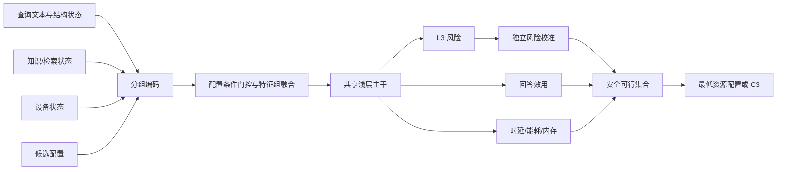

# 论文方法部分结构描述

## 3. 方法

### 3.1 问题定义

本文考虑资源受限边缘设备上的离线应急检索增强生成。给定查询 \(q_i\)，系统可以
选择三个生成配置：

\[
\mathcal C_g=\{C_0,C_1,C_2\},
\]

其中 \(C_0\) 表示无检索生成，\(C_1\) 表示单步 RAG，\(C_2\) 表示包含更强检索与
证据处理的复杂 RAG。\(C_3\) 表示澄清、拒答、协议模板或人工升级等安全回退，不
作为普通生成配置训练。

对查询 \(q_i\)，决策时可观测状态定义为：

\[
x_i=(q_i,z_i^{Q},z_i^{K},z_i^{D}),
\]

其中：

- \(z_i^{Q}\) 为查询风险、语言、歧义和信息完整性等结构化查询状态；
- \(z_i^{K}\) 为低成本预检索得到的知识覆盖、相关性、权威、时效和冲突状态；
- \(z_i^{D}\) 为温度、内存、负载和功率等实时设备状态。

对配置 \(c\in\mathcal C_g\)，定义：

\[
Y_{i,c}^{L3}\in\{0,1\}
\]

为是否发生协议驱动的 L3 严重失效；

\[
U_{i,c}\in[0,1]
\]

为必要行动完整率或回答效用；并定义资源向量：

\[
R_{i,c}=(L_{i,c},E_{i,c},M_{i,c}),
\]

其中 \(L\)、\(E\)、\(M\) 分别表示端到端时延、物理能耗和峰值内存。

本文的目标不是直接预测一个“最佳类别”，而是构造安全可行集合：

\[
\mathcal F_i=
\left\{
c\in\mathcal C_g:
\overline r_{i,c}\leq\alpha,\ 
\widehat Q_{0.95}(L_{i,c})\leq B_L,\ 
\widehat M_{i,c}\leq B_M,\ 
\widehat U_{i,c}\geq u_{\min}
\right\},
\]

其中 \(\overline r_{i,c}\) 表示经独立校准接受的严重失效风险，\(\alpha\) 为预注册
风险容忍度，\(B_L\) 和 \(B_M\) 为时延和内存预算，\(u_{\min}\) 为最低质量要求。

若 \(\mathcal F_i\neq\varnothing\)，系统选择预测能耗最低的配置：

\[
c_i^\star
=
\arg\min_{c\in\mathcal F_i}
\widehat Q_{0.50}(E_{i,c}).
\]

若 \(\mathcal F_i=\varnothing\)，则：

\[
c_i^\star=C_3.
\]

该定义将“风险是否可接受”“设备是否可运行”和“哪一安全配置资源最低”分解为三个
可检验步骤。

### 3.2 方法概览

本文方法由五个阶段组成：

1. 从查询文本、知识库和设备中提取决策前可观测状态；
2. 对查询与候选配置进行联合编码；
3. 预测每个配置的严重失效、效用和资源分布；
4. 使用独立校准集为各配置确定安全接受阈值；
5. 在线构造安全可行集合，选择资源最低配置或进入 C3。



### 3.3 输入表示

#### 3.3.1 查询文本表示

使用冻结的轻量预训练编码器 \(E_{\mathrm{text}}\) 将查询映射为语义向量：

\[
e_i^{T}=E_{\mathrm{text}}(q_i)\in\mathbb R^{d_e}.
\]

随后使用可训练投影层压缩表示：

\[
h_i^{T}
=
\phi\left(
\operatorname{LN}(W_T e_i^{T}+b_T)
\right)\in\mathbb R^{d},
\]

其中 \(\operatorname{LN}\) 为 LayerNorm，\(\phi\) 为 GELU 或 ReLU。文本编码器在
主实验中冻结，以降低小样本过拟合和 Radxa 训练需求。若编码器的设备端开销超过
净节省，则以 TF-IDF/BM25 表征替代 \(e_i^T\)。

#### 3.3.2 结构化状态表示

查询、知识和设备特征分别编码：

\[
h_i^{Q}=f_Q(z_i^{Q}),\qquad
h_i^{K}=f_K(z_i^{K}),\qquad
h_i^{D}=f_D(z_i^{D}),
\]

其中 \(f_Q,f_K,f_D\) 均为一层小型投影网络：

\[
f_m(z)=\operatorname{Dropout}
\left[
\phi\left(\operatorname{LN}(W_mz+b_m)\right)
\right].
\]

所有连续变量仅使用训练集统计量标准化。缺失值由训练集规则填补，并增加对应缺失
指示变量。知识状态来自决策前的低成本预检索，不能使用 gold evidence，也不能先
完整执行 C2 再决定是否选择 C2。

#### 3.3.3 配置表示

为每个候选配置定义可学习嵌入：

\[
e_c^{C}=\operatorname{Emb}(c)\in\mathbb R^{d_c}.
\]

配置输入还可拼接是否检索、检索深度、重排开关、上下文预算和冷态资源画像等固定
属性。共享配置条件模型比为 C0–C2 分别训练独立深网更节省参数，并能利用同一查询
在不同配置下的相关信息。

### 3.4 配置条件特征融合

知识和设备状态对不同配置的重要性不同。例如，知识覆盖对 C0 的直接作用弱于 C1/
C2，而设备温度和内存对 C2 更敏感。因此使用轻量门控：

\[
g_{i,c}^{K}
=
\sigma\left(
W_g^K[h_i^K;e_c^C]+b_g^K
\right),
\]

\[
g_{i,c}^{D}
=
\sigma\left(
W_g^D[h_i^D;e_c^C]+b_g^D
\right),
\]

\[
\widetilde h_{i,c}^{K}
=g_{i,c}^{K}\odot h_i^K,\qquad
\widetilde h_{i,c}^{D}
=g_{i,c}^{D}\odot h_i^D.
\]

为防止错误门控完全屏蔽安全信号，融合层同时保留原始投影和门控投影：

\[
v_{i,c}
=
[h_i^T;h_i^Q;h_i^K;\widetilde h_{i,c}^K;
h_i^D;\widetilde h_{i,c}^D;e_c^C].
\]

在标准 AI+ 版本中，可增加单头特征组注意力。设特征组集合为：

\[
\mathcal M=\{T,Q,K,D,C\},
\]

则：

\[
a_{i,c,m}
=
\frac{
\exp\left(w_a^\top\tanh(W_a h_{i,c}^{m})\right)
}{
\sum_{m'\in\mathcal M}
\exp\left(w_a^\top\tanh(W_a h_{i,c}^{m'})\right)
},
\]

\[
h_{i,c}^{A}
=
\sum_{m\in\mathcal M}a_{i,c,m}h_{i,c}^{m}.
\]

最终融合表示为：

\[
\widetilde v_{i,c}=[v_{i,c};h_{i,c}^{A}].
\]

注意力只用于轻量自适应融合和诊断，不能解释为因果贡献或统计安全保证。

### 3.5 共享预测主干

融合表示进入两层浅层残差网络：

\[
r_{i,c}^{(1)}
=
\operatorname{Dropout}
\left[
\phi(W_1\widetilde v_{i,c}+b_1)
\right],
\]

\[
r_{i,c}^{(2)}
=
\phi(W_2r_{i,c}^{(1)}+b_2),
\]

\[
h_{i,c}
=
r_{i,c}^{(2)}+W_s\widetilde v_{i,c}.
\]

主干深度限制为两至三层，原因是当前监督训练查询规模较小。共享主干学习“高风险
查询—低知识覆盖—设备资源不足—复杂配置”等交互，多任务头则分别建模安全、质量
和资源结果。

### 3.6 多任务输出

#### 3.6.1 严重失效风险

\[
\widehat p_{i,c}^{L3}
=
\sigma(w_r^\top h_{i,c}+b_r).
\]

\(\widehat p_{i,c}^{L3}\) 是排序和校准使用的原始分数，不直接等同于安全保证。

#### 3.6.2 回答效用

\[
\widehat U_{i,c}
=
\sigma(w_u^\top h_{i,c}+b_u).
\]

效用标签可以是必要行动完整率，也可在预注册后扩展为协议支持率与完整率的组合，
但主实验期间不能修改定义。

#### 3.6.3 资源分位数

分别预测时延和能耗的中位数与上分位数：

\[
\widehat Q_\tau(L_{i,c})
=
\exp(w_{L,\tau}^\top h_{i,c}+b_{L,\tau}),
\]

\[
\widehat Q_\tau(E_{i,c})
=
\exp(w_{E,\tau}^\top h_{i,c}+b_{E,\tau}),
\quad \tau\in\{0.50,0.95\}.
\]

峰值内存预测为：

\[
\widehat M_{i,c}
=
\operatorname{softplus}(w_M^\top h_{i,c}+b_M).
\]

使用上分位数而非平均值判断时延可行性，可以降低热态长尾和偶然后台负载造成的
约束越界。

#### 3.6.4 回退辅助头

\[
\widehat p_i^{FB}
=
\sigma(w_f^\top[h_i^T;h_i^Q;h_i^K;h_i^D]+b_f).
\]

该头可同时预测信息不足、知识不可用、协议冲突和资源不足等回退原因。它提供辅助
监督和解释，但最终 C3 决策仍由校准安全集合和硬规则共同决定。

### 3.7 训练目标

总损失定义为：

\[
\mathcal L
=
\lambda_r\mathcal L_{\mathrm{risk}}
+\lambda_b\mathcal L_{\mathrm{Brier}}
+\lambda_u\mathcal L_{\mathrm{utility}}
+\lambda_L\mathcal L_{\mathrm{latency}}
+\lambda_E\mathcal L_{\mathrm{energy}}
+\lambda_M\mathcal L_{\mathrm{memory}}
+\lambda_f\mathcal L_{\mathrm{fallback}}
+\lambda_2\|\theta\|_2^2.
\]

风险头使用二元交叉熵：

\[
\mathcal L_{\mathrm{risk}}
=
-\sum_{i,c}
\left[
y_{i,c}^{L3}\log\widehat p_{i,c}^{L3}
+(1-y_{i,c}^{L3})
\log(1-\widehat p_{i,c}^{L3})
\right],
\]

并加入 Brier loss：

\[
\mathcal L_{\mathrm{Brier}}
=
\sum_{i,c}
\left(
\widehat p_{i,c}^{L3}-y_{i,c}^{L3}
\right)^2.
\]

效用和内存使用 Huber loss。资源上分位数使用 pinball loss：

\[
\rho_\tau(u)
=
\max(\tau u,(\tau-1)u),
\]

\[
\mathcal L_{\mathrm{latency}}
=
\sum_{i,c,\tau}
\rho_\tau
\left(
\log L_{i,c}
-\log\widehat Q_\tau(L_{i,c})
\right),
\]

能耗损失同理。若没有物理功率测量，则该运行的能耗 loss mask 为 0，不能以 token
数、FLOPs 或时延代替焦耳。

所有损失权重 \(\lambda\) 仅在验证集上选择。独立校准集只用于安全阈值，测试集不
参与模型、损失权重或阈值选择。

严重失效类别不平衡时，优先采用查询组级分层 batch、有限正类权重和多随机种子。
不默认采用 focal loss，因为其可能提高分类区分度却损害概率质量。

### 3.8 独立安全校准

模型训练结束后冻结参数。对每个配置 \(c\)，在独立校准集：

\[
\mathcal D_{\mathrm{cal}}
=
\{(\widehat p_{j,c}^{L3},y_{j,c}^{L3})\}_{j=1}^{n_{\mathrm{cal}}}
\]

上选择接受阈值。

对候选阈值 \(t\)，定义接受集合：

\[
A_c(t)
=
\{j:\widehat p_{j,c}^{L3}\leq t\}.
\]

令：

\[
n_c(t)=|A_c(t)|,
\]

\[
k_c(t)
=
\sum_{j\in A_c(t)}y_{j,c}^{L3}.
\]

使用单侧 Clopper–Pearson 上界：

\[
U_c(t)
=
\operatorname{Beta}^{-1}
\left(
1-\delta_c;
k_c(t)+1,\,
n_c(t)-k_c(t)
\right),
\]

当 \(k_c(t)=n_c(t)\) 时令 \(U_c(t)=1\)。为控制三个配置的联合置信水平，可采用
Bonferroni 分配：

\[
\delta_c=\frac{\delta}{|\mathcal C_g|}.
\]

最终阈值选择为：

\[
t_c^\star
=
\arg\max_t n_c(t)
\quad
\text{s.t.}\quad
U_c(t)\leq\alpha.
\]

如果不存在满足条件的阈值，则该配置在部署时不进入安全接受集合。该过程控制的是
被接受配置的经验严重失效风险上界，而不是要求原始神经网络概率完全校准。

该保证依赖校准样本与部署查询的可比性、L3 标签质量和预注册损失定义。跨灾种、
语言或协议版本变化时必须单独检查，不能解释为无条件安全。

### 3.9 在线配置选择

对新查询，系统首先执行一次低成本状态提取，然后对三个生成配置进行并行风险与资源
预测。安全集合定义为：

\[
\mathcal S_i
=
\left\{
c\in\mathcal C_g:
\widehat p_{i,c}^{L3}\leq t_c^\star
\right\}.
\]

进一步施加设备硬约束和最低效用要求：

\[
\mathcal F_i
=
\left\{
c\in\mathcal S_i:
\widehat Q_{0.95}(L_{i,c})\leq B_L,\,
\widehat M_{i,c}\leq B_M,\,
\widehat U_{i,c}\geq u_{\min}
\right\}.
\]

选择规则为：

\[
c_i^\star=
\begin{cases}
\arg\min_{c\in\mathcal F_i}
\widehat Q_{0.50}(E_{i,c}),
& \mathcal F_i\neq\varnothing,\\
C_3,
& \mathcal F_i=\varnothing.
\end{cases}
\]

若物理能耗模型不可用，则正式实验不能声称实现能耗最优化。开发模式可以使用时延
作为临时排序目标，但必须明确标记，不能把它写成能耗结果。

## 4. 模块流程伪代码

### 算法 1：多任务预测器训练

```text
输入：
    训练集 D_train
    验证集 D_valid
    候选生成配置 Cg = {C0, C1, C2}
    冻结文本编码器 E_text

输出：
    冻结后的参数 θ*

1  用 D_train 统计连续特征均值、方差和缺失填补规则
2  初始化分组投影、配置 embedding、融合主干和多任务输出头
3  for train_seed in 预注册训练种子集合 do
4      重置可训练参数和数据顺序
5      repeat
6          从 D_train 采样一组独立查询
7          for 每个查询 i do
8              计算冻结文本表示 e_i^T = E_text(q_i)
9              提取决策前查询、知识和设备状态
10             for c in Cg do
11                 构造 query–configuration 表示
12                 计算风险、效用、时延、能耗和内存预测
13                 仅对标签可用的任务计算 masked loss
14             end for
15         end for
16         反向传播总损失并更新可训练参数
17         在 D_valid 上评价预注册模型选择指标
18     until 达到最大 optimizer steps 或早停
19     保存验证规则自动选择的 checkpoint
20 end for
21 按预注册规则选择单模型或 seed ensemble
22 冻结全部参数，禁止使用 calibration/test 修改 θ
```

### 算法 2：配置级风险阈值校准

```text
输入：
    冻结预测器 f_θ
    独立校准集 D_cal
    风险容忍度 α
    总失败概率 δ
    候选配置 Cg

输出：
    每配置阈值 {t_c*}

1  设置 δ_c = δ / |Cg|
2  for c in Cg do
3      对 D_cal 中每个查询计算风险分数 p_j,c
4      按 p_j,c 从小到大排序
5      初始化 t_c* = 无可行阈值
6      增量扫描每个唯一候选阈值 t
7          统计接受数 n_c(t) 和严重失效数 k_c(t)
8          计算单侧 Clopper–Pearson 上界 U_c(t)
9          if U_c(t) ≤ α then
10             t_c* = 当前 coverage 最大的可行阈值
11         end if
12     end for
13 end for
14 冻结 {t_c*}，禁止在测试集修改
```

### 算法 3：在线安全约束配置选择

```text
输入：
    新查询 q
    当前设备状态 zD
    冻结知识库与低成本预检索器
    冻结预测器 f_θ
    校准阈值 {t_c*}
    时延预算 B_L、内存预算 B_M、最低效用 u_min

输出：
    C0、C1、C2 或 C3

1  提取查询状态 zQ
2  执行低成本预检索，得到知识状态 zK
3  读取设备状态 zD；记录缺失和异常标志
4  初始化可行集合 F = ∅
5  for c in {C0, C1, C2} do
6      预测 p_L3、utility、latency_P95、energy_P50、memory
7      if p_L3 ≤ t_c*
           and latency_P95 ≤ B_L
           and memory ≤ B_M
           and utility ≥ u_min then
8          将 c 加入 F
9      end if
10 end for
11 if F 为空 then
12     返回 C3，并记录无安全可行配置的原因
13 else
14     返回 F 中 energy_P50 最低的配置
15 end if
```

## 5. 复杂度分析

设：

- \(n\) 为查询 token 数；
- \(d_e\) 为冻结文本编码器隐藏维度；
- \(d\) 为融合主干隐藏维度；
- \(p\) 为结构化特征总数；
- \(K=|\mathcal C_g|=3\) 为生成候选配置数；
- \(M=5\) 为特征组数量；
- \(N_{\mathrm{cal}}\) 为校准查询数。

### 5.1 文本编码

若使用标准全注意力小型 Transformer，单查询编码复杂度近似为：

\[
O(n^2d_e+nd_e^2),
\]

内存复杂度为：

\[
O(n^2+nd_e).
\]

由于文本编码对三个配置共享，只执行一次，而不是执行 \(K\) 次。若使用 TF-IDF/
哈希向量，在线复杂度可近似降为查询非零特征数的线性复杂度。

### 5.2 结构化编码与融合

分组投影复杂度为：

\[
O(pd).
\]

配置条件门控、主干和输出头对每个配置执行，复杂度为：

\[
O(Kd^2).
\]

单头特征组注意力只在 \(M\) 个组上运行：

\[
O(KMd),
\]

因为 \(M=5\) 且 \(K=3\)，其开销远低于 token-level cross-attention。

因此，不含文本编码和低成本预检索时，AI+ 路由器总复杂度为：

\[
O(pd+Kd^2+KMd),
\]

内存为：

\[
O(d_e+Kd).
\]

### 5.3 知识状态提取

若使用倒排索引 BM25，查询开销取决于查询词对应倒排列表长度。维护 top-\(r\)
候选的额外开销约为：

\[
O(H_q\log r),
\]

其中 \(H_q\) 为查询词命中的 posting 总数。该预检索必须显著轻于完整 C1/C2，
否则路由前置开销会抵消配置选择收益。

### 5.4 离线校准

每个配置先排序风险分数：

\[
O(N_{\mathrm{cal}}\log N_{\mathrm{cal}}).
\]

排序后增量累计接受数和错误数，扫描复杂度为：

\[
O(N_{\mathrm{cal}}).
\]

三个配置的总校准复杂度为：

\[
O(KN_{\mathrm{cal}}\log N_{\mathrm{cal}}).
\]

校准只离线执行一次，不增加单查询在线复杂度。

### 5.5 在线选择

获得所有预测后，构造安全集合并选择最低能耗配置的复杂度为：

\[
O(K).
\]

因为 \(K=3\)，最终决策开销可忽略。实际系统瓶颈通常是文本编码、预检索和下游
生成，因此论文必须报告路由器完整端到端时延、能耗和峰值内存，而不只报告 MLP
计算量。

## 6. 与已有模型的差异

### 6.1 与 Adaptive-RAG 式复杂度路由的差异

Adaptive-RAG 式方法主要根据查询复杂度在无检索、单步检索和迭代检索之间选择。
本文不把“查询复杂度”视为配置需求的充分条件，而联合使用：

- 查询风险与信息完整性；
- 当前知识库覆盖、权威、时效和冲突；
- Radxa 实时温度、内存和负载；
- 协议驱动 L3 严重失效风险。

此外，本文使用独立校准形成安全接受集合，而不是直接将复杂度分类结果作为配置。

### 6.2 与 FLARE/Self-RAG 式动态检索的差异

FLARE/Self-RAG 类方法在生成过程中依据 token 置信度、检索必要性或反思信号动态
检索。本文主要在生成前选择完整 RAG 配置，避免在资源受限设备上反复生成和检索
造成不可控尾时延。内部置信度不被直接解释为安全概率；安全标签来自协议驱动人工
判定，并由独立校准集控制接受风险。

二者并不互斥：未来可将动态检索作为 C2 内部实现，但其额外时延和能耗必须计入
C2，而不能计入路由器收益。

### 6.3 与 RouteLLM/级联路由的差异

RouteLLM 和级联路由主要在强弱模型之间优化偏好质量与调用成本。本文的候选对象是
无检索、单步 RAG、复杂 RAG 和安全回退，差异不仅来自模型规模，还来自检索、
协议验证和知识状态。本文使用真实设备时延、物理能耗和内存约束，而不是 API 价格
或模型调用率；目标标签是应急严重失效，而非一般偏好胜率。

### 6.4 与 query+corpus RAG 路由的差异

RAGRouter 类思想强调最优 RAG 配置取决于查询与语料属性。本文保留查询—知识联合
输入，同时加入实时设备状态和配置级校准安全门。因而，相同查询和知识库在冷态、
热态或低内存状态下可以产生不同选择。

### 6.5 与选择性预测/SelectiveNet 的差异

选择性预测通常联合学习任务输出和拒答概率，在目标 coverage 下优化选择风险。
本文把拒答扩展为多配置安全集合：系统先判断每个 C0–C2 是否满足配置级风险与资源
约束，再在安全集合内进行资源优化。C3 不是一个普通低置信拒答头，而是无安全配置
时的显式服务策略。

### 6.6 与保形强弱模型路由的差异

现有安全路由通常控制二元弱模型路径的失败比例。本文扩展到三个异质 RAG 生成配置，
并加入协议严重失效、效用下限、设备硬约束和物理能耗排序。为避免多个配置分别校准
产生联合置信度膨胀，本文明确分配 \(\delta_c=\delta/K\)。

### 6.7 与能耗感知边缘路由的差异

能耗感知路由通常预测不同模型的能量或在给定预算下最大化准确率。本文把设备资源
预测与应急协议安全门结合：只有通过严重失效风险控制的配置才参与能耗优化，并在
持续热负载下更新设备状态。能耗必须来自目标设备的物理功率积分，不能由参数量、
FLOPs 或 token 数替代。

### 6.8 方法差异总结

| 方法类别 | 主要输入 | 候选动作 | 优化目标 | 显式安全校准 | 实时设备状态 | 应急协议损失 |
| --- | --- | --- | --- | --- | --- | --- |
| Adaptive-RAG 式 | 查询复杂度 | 无/单步/迭代检索 | 平均质量与效率 | 否 | 否 | 否 |
| FLARE/Self-RAG 式 | token 置信度/反思 | 动态检索 | 生成质量与证据支持 | 通常否 | 否 | 否 |
| RouteLLM 式 | 查询/偏好 | 强弱模型 | 偏好质量与费用 | 通常否 | 否 | 否 |
| query+corpus 路由 | 查询与语料 | RAG 范式 | 配置效用 | 通常否 | 否 | 否 |
| 选择性预测 | 模型表示 | 回答/拒答 | risk–coverage | 部分 | 否 | 通常否 |
| 二元安全路由 | 查询表示 | 强/弱路径 | 约束风险与成本 | 是 | 通常否 | 否 |
| 本文方法 | 查询+知识+设备+配置 | C0/C1/C2/C3 | 严重风险约束下最小设备资源 | 是 | 是 | 是 |

上述比较应写成“本文联合考虑了现有方法通常分别处理的因素”，不宜在未完成更新检索
前声称“首次”或“完全无人研究”。

## 7. 方法假设与适用边界

本文方法依赖以下条件：

1. 校准样本与部署输入在风险机制上具有足够可比性；
2. L3 标签能够反映实际应急危害，并经过专家一致性检查；
3. 决策前知识状态不使用 gold evidence 或测试结果；
4. 设备传感器单位、采样时间和功率覆盖范围已验证；
5. 资源预测误差通过上分位数、持续负载实验和硬故障回退处理；
6. 配置集合固定；增加模型、修改知识库或改变量化后需要重新画像和校准；
7. 注意力权重和模型概率只提供预测信息，不能单独构成安全证明。

发生跨灾种、跨语言、协议更新、设备更换或明显热状态偏移时，应暂停原阈值的安全
解释，运行挑战集检查并按预注册规则重新校准。

## 8. 可直接用于论文的方法概述

> 本文将离线应急 RAG 路由建模为有限候选配置上的校准风险约束优化问题。对每个
> 查询，模型联合编码查询语义、信息完整性、知识库覆盖与冲突状态、目标设备实时
> 资源状态以及候选配置属性，并通过共享浅层多任务网络分别预测 C0–C2 的协议严重
> 失效风险、回答效用及资源分位数。为避免将神经网络原始置信度直接解释为安全
> 概率，本文在独立校准集上为每个配置选择满足预设严重失效风险上界的接受阈值，
> 并通过置信度分配处理多配置同时校准。部署时，系统首先排除风险、时延、内存或
> 最低效用不满足约束的配置，再从剩余集合中选择预测物理能耗最低者；若集合为空，
> 则进入澄清、拒答或人工升级等 C3 安全回退。该设计使风险控制、资源优化和服务
> 回退分别具有明确的统计和系统含义。
